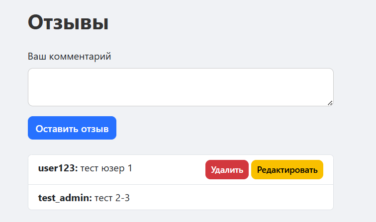
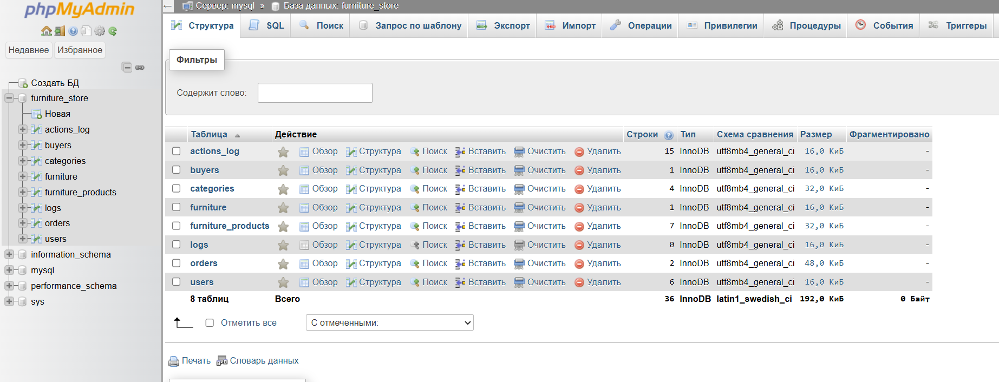
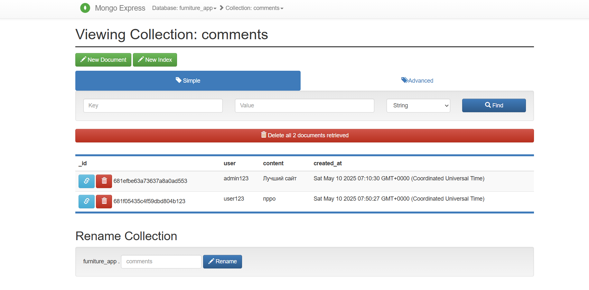

# Furniture Store — PHP + MySQL + MongoDB + Docker Web App

Веб-приложение для управления мебелью, заказами, отзывами и пользователями.

**Цель проекта** — реализовать систему с полным CRUD-функционалом, логированием и ролевым управлением доступом, использующую две базы данных:
- **MySQL** — для хранения основной информации (пользователи, мебель, заказы)
- **MongoDB** — для хранения отзывов пользователей.<br>
<br>
Приложение полностью развернуто в Docker-среде и включает:
- Apache + PHP
- MySQL + phpMyAdmin
- MongoDB + Mongo Express

---

## 🚀 Инструкции по запуску проекта

1. Убедитесь, что установлен Docker + Docker Compose
2. Клонируйте/скачайте проект в любую папку (например `C:/SisGBD/...`)
3. Создайте структуру директорий, если не создана:
```bash
mkdir -p docker/apache
```
4. Создайте/проверьте файлы:
- `docker-compose.yml`
- `docker/apache/Dockerfile`
- `docker/apache/apache-config.conf`
5. Запустите проект:
```bash
docker-compose up -d --build
```
6. Импортируйте MySQL-базу данных (если нужно):
```bash
Get-Content furniture_store.sql | docker exec -i furniture_mysql mysql -uroot -proot furniture_store
```
7. Перейдите в браузере на:
- Приложение: `http://localhost`
- phpMyAdmin: `http://localhost:8080`
- Mongo Express: `http://localhost:8081`<br>
 **Логин:** admin  <br>
 **Пароль:** admin

---

## 📁 Структура проекта и основные страницы
- `index.php` — каталог мебели (MySQL)
- `pages/buyers.php` — управление покупателями (MySQL)
- `pages/orders.php` — оформление заказов (MySQL)
- `pages/logs.php` — журнал действий (MySQL)
- `pages/comments.php` — отзывы (MongoDB)
- `pages/statistics.php` — статистика (MongoDB)
- `login.php / register.php` — авторизация (MySQL)
- `includes/, db/, templates/` — логика, подключение и оформление

---

## 🧩 Функциональность

| Возможность                                 | Admin   | User |
| ------------------------------------------- | :---:   | :--: |
| Просмотр каталога                           |   ✅   |   ✅ |
| Добавление, редактирование, удаление мебели |   ✅   |   ❌ | |
| Управление покупателями                     |   ✅   |   ❌ | |
| Оформление заказов                          |   ✅   |   ✅ | |
| Просмотр логов                              |   ✅   |   ❌ | |
| Отзывы: добавление, удаление своих          |   ✅   |   ✅ | |
| Отзывы: удаление любых                      |   ✅   |   ❌ |
| Просмотр статистики                         |   ✅   |   ✅ |

---

## 💬 Работа с отзывами (MongoDB)

MongoDB используется для хранения отзывов. Каждый пользователь может:
- оставить комментарий
- редактировать и удалять свои отзывы
- администратор может удалять любые

Используется библиотека `mongodb/mongodb` и расширение `mongodb.so`.

### Структура MongoDB (коллекция furniture_app.comments):
```javascript
{
  _id: ObjectId,
  user: string,       
  content: string,    
  created_at: datetime
}
```

---

## 🗄️ Работа с основной базой данных (MySQL)

### Хранит всю бизнес-логику приложения:
- таблицы пользователей, товаров, заказов, покупателей
- все операции проходят через PDO с защитой от SQL-инъекций
- таблица `actions_log` хранит системные события

### Таблицы:
- `users(id, login, password, role, token)`
- `furniture(id, name, description, price, image)`
- `buyers(id, name, email)`
- `orders(buyer_id, furniture_id)`
- `actions_log(id, action, created_at)`

---

## 🔐 Сценарии взаимодействия

### 👨‍💼 Администратор:
- Управляет товарами и заказами
- Видит покупателей и действия
- Может редактировать/удалять отзывы

### 👤 Пользователь:
- Оформляет заказы
- Пишет и редактирует отзывы
- Просматривает каталог

---

## 💬 Примеры использования (ключевые фрагменты кода)

### Подключение MySQL (PDO)

```php
$pdo = new PDO("mysql:host=mysql;dbname=furniture_store;charset=utf8", "root", "root");
```

### Подключение MongoDB (через библиотеку `mongodb/mongodb`)

```php
require_once __DIR__ . '/../vendor/autoload.php';

use MongoDB\Client;
$mongo = new Client("mongodb://furniture_mongo:27017");
$collection = $mongo->furniture_app->comments;
```

### CREATE (создание) - Добавление новой мебели

```php
    $stmt = $pdo->prepare("INSERT INTO furniture (name, description, price, image) VALUES (?, ?, ?, ?)");
    $stmt->execute([$name, $description, $price, $image]);
```
### CREATE (создание) - Добавление отзыва (MongoDB)

```php
    $collection->insertOne([
      'user' => $login,
      'content' => $content,
      'created_at' => new UTCDateTime()
    ]);
```

### READ (чтение) - Отображение мебели в каталоге

```php
    $products = $pdo->query("SELECT * FROM furniture ORDER BY id DESC")->fetchAll();
```
### READ (чтение) - Отзывы (MongoDB)

```php
    $comments = $collection->find([], ['sort' => ['created_at' => -1]]);
```

### UPDATE (обновление) - Редактирование мебели

```php
    $stmt = $pdo->prepare("UPDATE furniture SET name = ?, description = ?, price = ?, image = ? WHERE id = ?");
    $stmt->execute([$name, $description, $price, $image, $id]);
```

### UPDATE (обновление) - Редактирование комментария (MongoDB)

```php
    $collection->updateOne(
      ['_id' => new ObjectId($id), 'user' => $login],
      ['$set' => ['content' => $newContent]]
    );
```

### DELETE (удаление) - Удаление мебели

```php
    $stmt = $pdo->prepare("DELETE FROM furniture WHERE id = ?");
    $stmt->execute([$id]);
```

### DELETE (удаление) - Удаление комментария (MongoDB)

```php
    $collection->deleteOne(['_id' => new ObjectId($_GET['delete'])]);
```

### Примеры статистики (на основе READ) - Самые популярные товары

```php
    SELECT f.name, COUNT(*) AS count
    FROM orders o
    JOIN furniture f ON o.furniture_id = f.id
    GROUP BY o.furniture_id
    ORDER BY count DESC
    LIMIT 5
```

---

## 🔐 Сценарии взаимодействия
**👨‍💼 Администратор:**
- Входит в систему
- Управляет товарами
- Управляет покупателями
- Просматривает логи
- Может редактировать/удалять отзывы

**👤 Обычный пользователь:**
- Входит в систему
- Просматривает каталог
- Добавляет заказ
- Пишет и редактирует отзывы

---

##  🔐 Доступ в систему (тестовые данные)

**👨‍💼 Администратор:**
- **Логин:** admin123  
- **Пароль:** 123

**👤 Обычный пользователь:**
- **Логин:** user123  
- **Пароль:** 1234

---

##  🔐 Структура баз данных

### MySQL `users`
| Поле     | Тип          |
| -------- | ------------ |
| id       | INT, PK, AI  |
| login    | VARCHAR(255) |
| password | VARCHAR(255) |
| role     | VARCHAR(50)  |
| token    | VARCHAR(255) |

### MySQL `furniture`
| Поле        | Тип           |
| ----------- | ------------- |
| id          | INT, PK, AI   |
| name        | VARCHAR(255)  |
| description | TEXT          |
| price       | DECIMAL(10,2) |
| image       | VARCHAR(255)  |

### MySQL `buyers`
| Поле        | Тип           |
| ----------- | ------------- |
| id          | INT, PK, AI   |
| name        | VARCHAR(255)  |
| description | TEXT          |
| price       | DECIMAL(10,2) |
| image       | VARCHAR(255)  |

### MySQL `actions_log`
| Поле        | Тип         |
| ----------- | ----------- |
| id          | INT, PK, AI |
| action      | TEXT        |
| created\_at | DATETIME    |

### Коллекция MongoDB `comments`
| Поле        | Тип         |
| ----------- | ----------- |
| _id         | ObjectId    |
| user        | string      |
| content     | string      |
| created_at  | UTCDateTime |

---

## 🧭 Примеры использования
- Каталог с возможностью просмотра пользователей, редактирования и удаления (админ):<br>
<br>
- Каталог с возможностью просмотра пользователей, редактирования и удаления (пользователь):<br>
<br>
- Форма добавления товара с валидацией полей (админ):<br>
<br>
<br>
- Просмотр, поиск и добавление покупателей так же с валидацией полей (админ):<br>
<br>
<br>
- Добавление заказа, удалением и поиском (админ):<br>
<br>
- Просмотр логов (админ):<br>
<br>
- Поиск по приложению:<br>
<br>
- Вход в систему:<br>
<br>
- Регистрация:<br>
<br>
- Ограничение прав для пользователя:<br>
<br>
- Добавление отзывов, редактирование и удаление:<br>
<br>
- phpMyAdmin:<br>
<br>
- Mongo Express:<br>
<br>

---

## 🧭 Используемые технологии
- PHP 8.2 + Apache
- MySQL 5.7
- MongoDB + mongo-express
- phpMyAdmin
- Bootstrap 5
- Docker + Docker Compose

---

## 🔗 Использованные источники
- [PHP Manual](https://www.php.net/manual/ru/)
- [Bootstrap](https://getbootstrap.com/)
- [w3schools](https://www.w3schools.com/php/)
- [MongoDB PHP](https://www.mongodb.com/docs/php-library/current/)
- [ChatGPT](https://chatgpt.com/)