# Furniture Store — PHP CRUD Web App

Веб-приложение для управления мебелью, заказами и пользователями.

**Цель** — реализовать веб-приложение на PHP с возможностью:
- Аутентификации пользователей (admin, user)
- Управления товарами (CRUD)
- Создания заказов
- Ограничения доступа на основе ролей
- Ведения журнала действий

---

## Инструкции по запуску проекта

1. Установите XAMPP (PHP 8+, MySQL, Apache)
2. Скопируйте проект в папку `htdocs`
3. Запустите Apache и MySQL через XAMPP
4. Импортируйте базу.
4. Перейдите в браузере на `http://localhost/index.php`

---

## Содержание
- `index.php` — просмотр каталога
- `pages/buyers.php` — управление покупателями (только admin)
- `pages/orders.php` — оформление заказов
- `pages/logs.php` — журнал действий
- `login.php / register.php` — авторизация
- `includes/, db/, templates/` — логика, подключение и оформление

---

##  Функциональность

| Возможность                                 | Admin   | User |
| ------------------------------------------- | :---:   | :--: |
| Просмотр каталога                           |   ✅   |   ✅ |
| Добавление, редактирование, удаление мебели |   ✅   |   ❌ | |
| Просмотр и добавление покупателей           |   ✅   |   ❌ | |
| Оформление заказов                          |   ✅   |   ✅ | |
| Просмотр логов                              |   ✅   |   ❌ | |
| Аутентификация, роли                        |   ✅   |   ✅ | |

---

## Примеры использования (ключевые фрагменты кода)

### Аутентификация (auth.php)

```php
    require_once __DIR__ . '/../db/db.php';

    $pdo = getPDO();
    $token = $_COOKIE['auth_token'] ?? null;

    if (!$token) {
        header('Location: /login.php');
        exit;
    }

    $stmt = $pdo->prepare("SELECT * FROM users WHERE token = ?");
    $stmt->execute([$token]);
    $user = $stmt->fetch();

    if (!$user) {
       setcookie('auth_token', '', time() - 3600, '/');
     header('Location: /login.php');
      exit;
    }

    function isAdmin(): bool {
       global $user;
      return $user['role'] === 'admin';
    }
```
### Добавление мебели (actions/add_furniture.php)

```php
    require_once __DIR__ . '/../includes/auth.php';
    if (!isAdmin()) {
       die("Доступ запрещён");
    }

    $pdo = getPDO();
    $name = trim($_POST['name']);
    $description = trim($_POST['description']);
    $price = (float)$_POST['price'];
    $image = trim($_POST['image']);

    $stmt = $pdo->prepare("INSERT INTO furniture (name, description, price, image) VALUES (?, ?, ?, ?)");
    $stmt->execute([$name, $description, $price, $image]);

    header("Location: ../index.php");
    exit;
```

### Ограничение прав доступа в buyers.php

```php
    require_once __DIR__ . '/../includes/auth.php';

    if (!isAdmin()) {
     header('Location: ../index.php');
      exit;
    }
```
### Добавление записи в журнал (includes/log_action.php)

```php
    require_once __DIR__ . '/../db/db.php';

    function logAction(string $message): void {
        $pdo = getPDO();
     $stmt = $pdo->prepare("INSERT INTO actions_log (action)    VALUES (?)");
      $stmt->execute([$message]);
    }
```

### Генерация токена при входе (login.php)

```php
    if ($user && password_verify($password, $user['password'])) {
     $token = bin2hex(random_bytes(32));
     setcookie('auth_token', $token, time() + 86400 * 7, '/');

      $stmt = $pdo->prepare("UPDATE users SET token = ? WHERE id = ?");
      $stmt->execute([$token, $user['id']]);

      header('Location: index.php');
     exit;
    }
```

---

## Сценарии взаимодействия
**👨‍💼 Администратор:**
- Входит в систему
- Управляет товарами
- Управляет покупателями
- Просматривает логи

**👤 Обычный пользователь:**
- Входит в систему
- Просматривает каталог
- Добавляет заказ

---

##  Логин и пароль

**👨‍💼 Администратор:**
- **Логин:** admin123  
- **Пароль:** 123

**👤 Обычный пользователь:**
- **Логин:** user123  
- **Пароль:** 1234

---

##  Структура баз данных

### БД `users`
| Поле     | Тип          |
| -------- | ------------ |
| id       | INT, PK, AI  |
| login    | VARCHAR(255) |
| password | VARCHAR(255) |
| role     | VARCHAR(50)  |
| token    | VARCHAR(255) |

### БД `furniture`
| Поле        | Тип           |
| ----------- | ------------- |
| id          | INT, PK, AI   |
| name        | VARCHAR(255)  |
| description | TEXT          |
| price       | DECIMAL(10,2) |
| image       | VARCHAR(255)  |

### БД `buyers`
| Поле        | Тип           |
| ----------- | ------------- |
| id          | INT, PK, AI   |
| name        | VARCHAR(255)  |
| description | TEXT          |
| price       | DECIMAL(10,2) |
| image       | VARCHAR(255)  |

### БД `actions_log`
| Поле        | Тип         |
| ----------- | ----------- |
| id          | INT, PK, AI |
| action      | TEXT        |
| created\_at | DATETIME    |

---

## Примеры использования
- Каталог с возможностью просмотра пользователей, редактирования и удаления (админ):
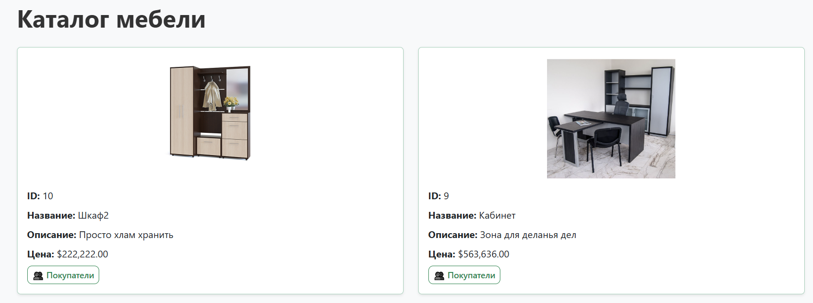<br>
- Каталог с возможностью просмотра пользователей, редактирования и удаления (пользователь):
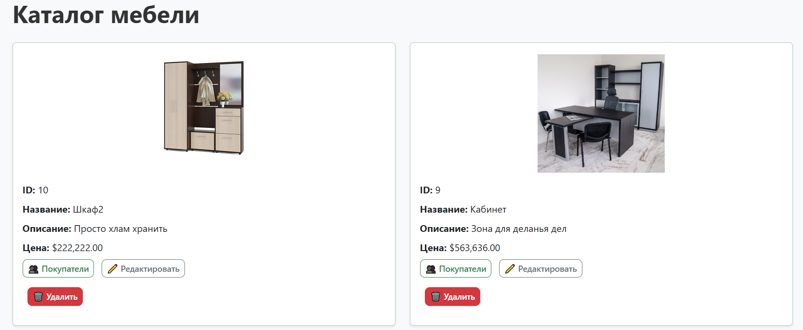<br>
- Форма добавления товара с валидацией полей (админ):
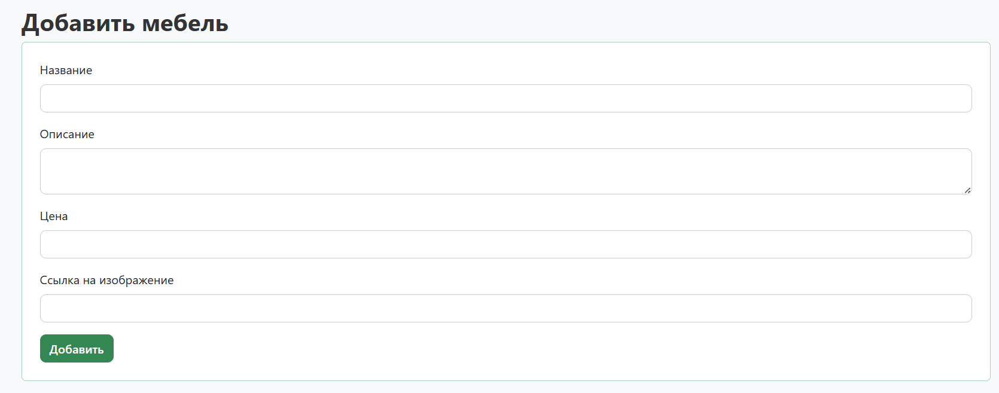<br>
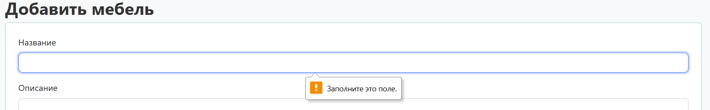<br>
- Просмотр, поиск и добавление покупателей так же с валидацией полей (админ):
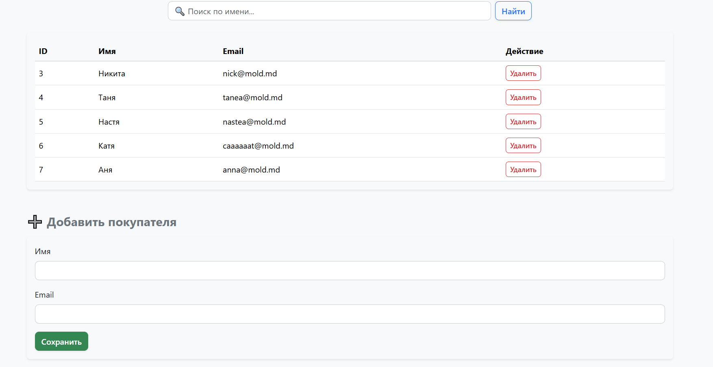<br>
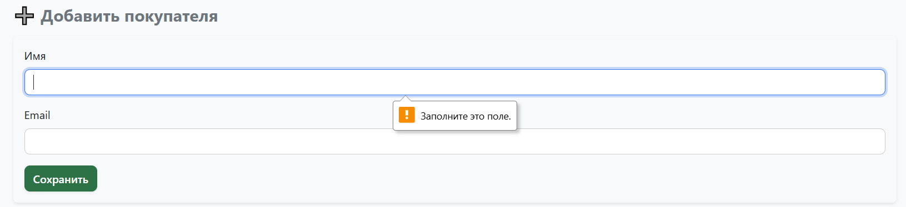<br>
- Добавление заказа, удалением и поиском (админ):
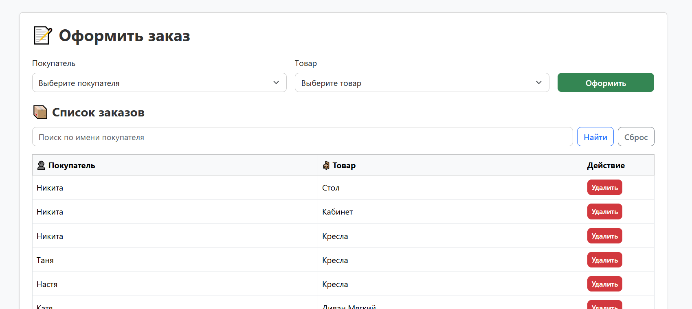<br>
- Просмотр логов (админ):
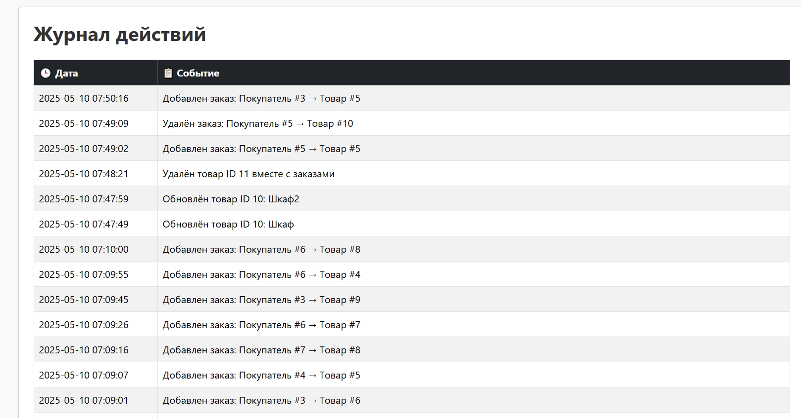<br>
- Поиск по приложению:
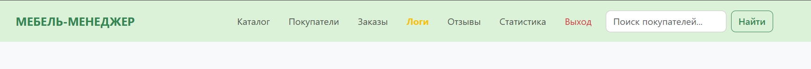<br>
- Вход в систему:<br>
<br>
- Регистрация:<br>
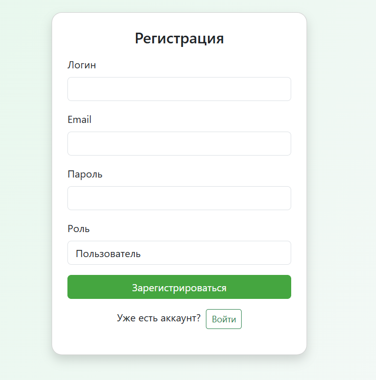<br>
- Ограничение прав для пользователя:
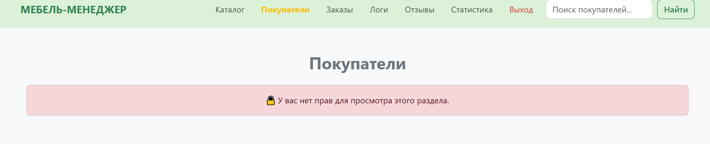<br>

---

## Использованные источники
- [php](https://www.php.net/manual/ru/)

- [getbootstrap](https://getbootstrap.com/)

- [w3schools](https://www.w3schools.com/php/)

- [ChatGPT](https://chatgpt.com/)